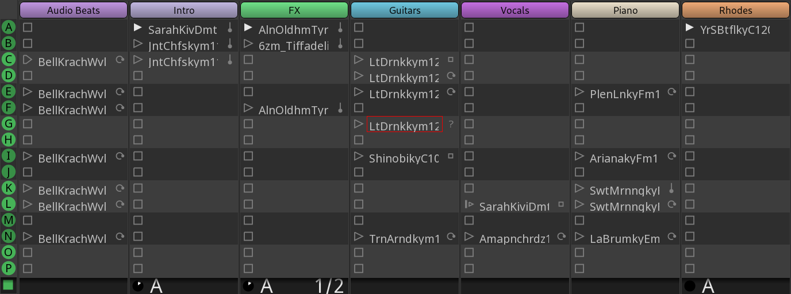







The Cue window provides tools for non-linear sequencing where you trigger the playback of short repeatable audio and MIDI clips.

## User interface organization

The main part of the Cue window is a grid of clips that are grouped by tracks and cues.

Tracks are laid out vertically and usually group clips with the same type of instrument. You can have one track for bass lines, one track for drums, one track for synth chord progressions, and so on. You can record new material to these tracks, then cut it and load into the cue sequencer. But as long as a track is visible in the Cue window, this material will not be played back. Only one clip in a track can play at any given time.

Cues, however, are laid out horizontally and organize clips that should start playing at the same time.

A fairly common layout is where you have one instrument playing 4 bars of intro in the first cue, then there’s a clip with a variation of that melody in the second cue plus the rhythm section. In the third cue you can slightly change the drum loop and the bass line and maybe add vocals.

## How the non-linear sequencer works

The non-linear nature of cues comes into play when you program the sequencer to play one clip a certain amount of times, then automatically trigger the playback of another clip in that track. So the transport will keep rolling, but the sequencer will go back and forth between clips.

## Trigger slots vs clips

The grid cell that contains a clip is called a trigger slot. It is called that way because it responds to an event that triggers the playback. Typically it is the pressing of a playback button, the pushing of a key on a MIDI controller, or a command in the sequencer.

Slots and clips are two different concepts. The way the clip is triggered, what grid unit it is quantized to, how many times a clip is played, or what clip is automatically triggered next — all these settings belong to a trigger slot. This is convenient, because if you decide to replace one clip with another, you don’t have to dial in all the settings once again.
