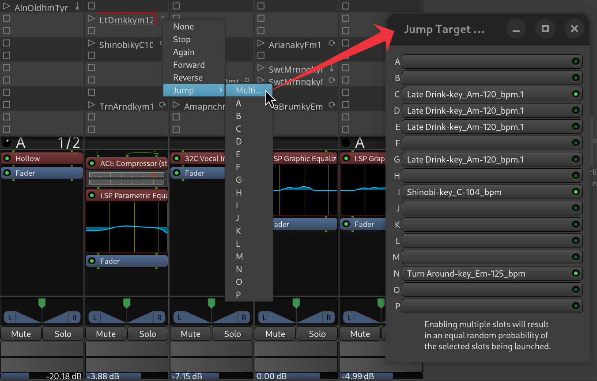







Now that you are already familiar with basic follow actions in the Cue window, let’s talk about programming probability.

In a nutshell, probability is how you can get Ardour to make happy little accidents for you to explore ideas. There are two ways you can use this feature.

<!-- FIXME SCREENSHOT -->

## Probability with follow actions

First of all, you can set two different types of a follow action for the same trigger slot. Let’s say the left option will be triggering the previous clip, and the right option will be triggering the next clip.

Now drag this slider to the right or scroll the mouse wheel so that the second option on the right gets a chance to be used at all.

When the slider sits exactly in the middle between the left and the right follow actions, these actions have equal probability of being used after the clip is done playing. You can drag it further to the right to give the right action a better fighting chance:

Or you can drag it all the way to the right so that the left action has no way of being used at all.

## Probability with Multi-Jump action

The second way you can program probability is by using the Multi-Jump follow action. Select this action and then toggle each trigger slot in the track that should get a chance of being played randomly.

Every time Ardour is done playing the clip in this trigger slot, it will randomly choose one of the slots that you previously selected.