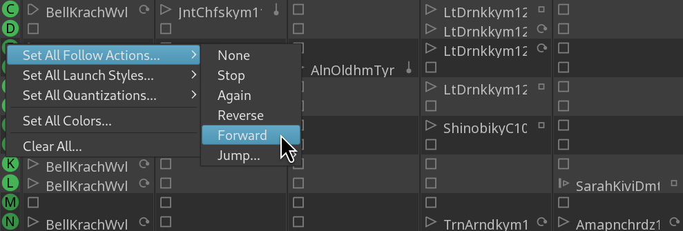







The _Follow Options_ group in the Cue window is where you program the sequence of clips.

An easy example of a sequence is a clip that plays 4 bars of intro in cue A, triggers the next clip from cue B that plays eight bars twice, then triggers the clip in cue D, which, after playing four bars four times, triggers the clip in cue B again, and then the B-to-D cycle repeats over and over again.

<!-- FIXME SCREENSHOT -->

It’s called “follow options” because these settings define what happens next, after a clip has been played once.

## Setting follow options

You have multiple ways to set a follow action.

1. You can do it in the drop-down list at the bottom:

2. You can click this widget to the right of the clips’s name and select an action:

3. You can also mass-select a follow action for the entire cue. To do that, right-click on cue's name and select **Set All Follow Actions**.

## Follow actions

The default behavior is to just play the same clip over and over again until the user triggers a different clip in that track or stops the playback. This action is called _Again_.

The _Reverse_ action starts playing back the clip that is in the previous slot in the track. So once a clip in Cue D has been played a given amount of times, Ardour triggers the clip in Cue C.

The _Forward_ action does the opposite and triggers the clip in the next slot, so from a clip in Cue D you will go to the clip in Cue E.

You can use the _Jump_ action to skip multiple cues going forward or backward and go straight to a cue of choice. So you can jump from Cue F to Cue M, and then from Cue M to cue B.

The _Follow Count_ option is where you set how many times a clip is played until it stops playing or triggers some other clip in the track. You can also control how much of the original clip is played. To do so, toggle this button and change the number of beats Ardour will play from the clip in the selected trigger slot.

The _Follow Count_ option is also what separates the _None_ follow action from the _Stop_ follow action.

If you want a clip to play a given number of times and stop, choose the _Stop_ action.

But if you want to temporarily drop the select number or repeats, disregard the customized duration of the clip, and just stop the playback after one time, select the _None_ follow action.